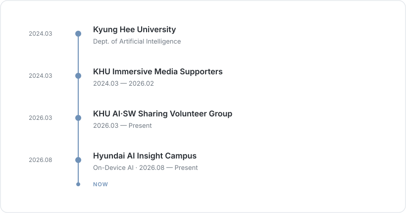

  

 

## `01 /` JOURNEY

  

 

## `02 /` PROJECTS

Currently organizing and improving my projects.

 

## `03 /` TECH STACK

LANGUAGES 

 

DEVELOPMENT 

 

AI / VISION 

 

PLATFORM / TOOLS 

 

## `04 /` ACTIVITY

  
  

